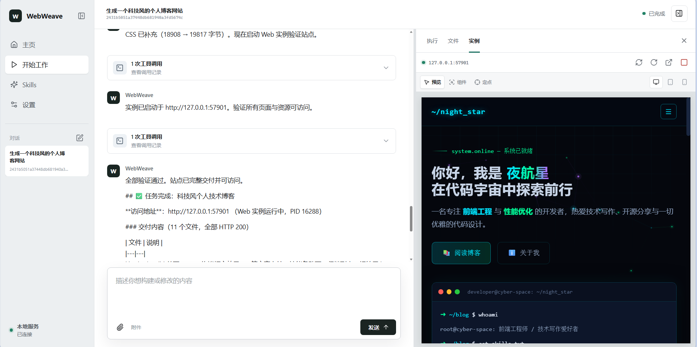
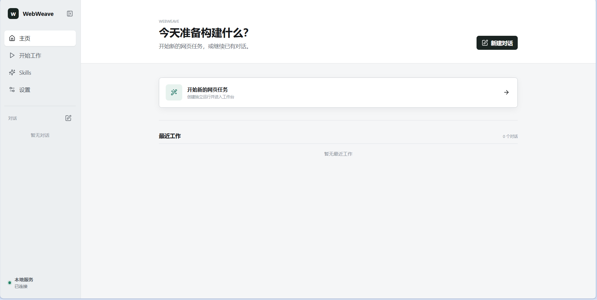
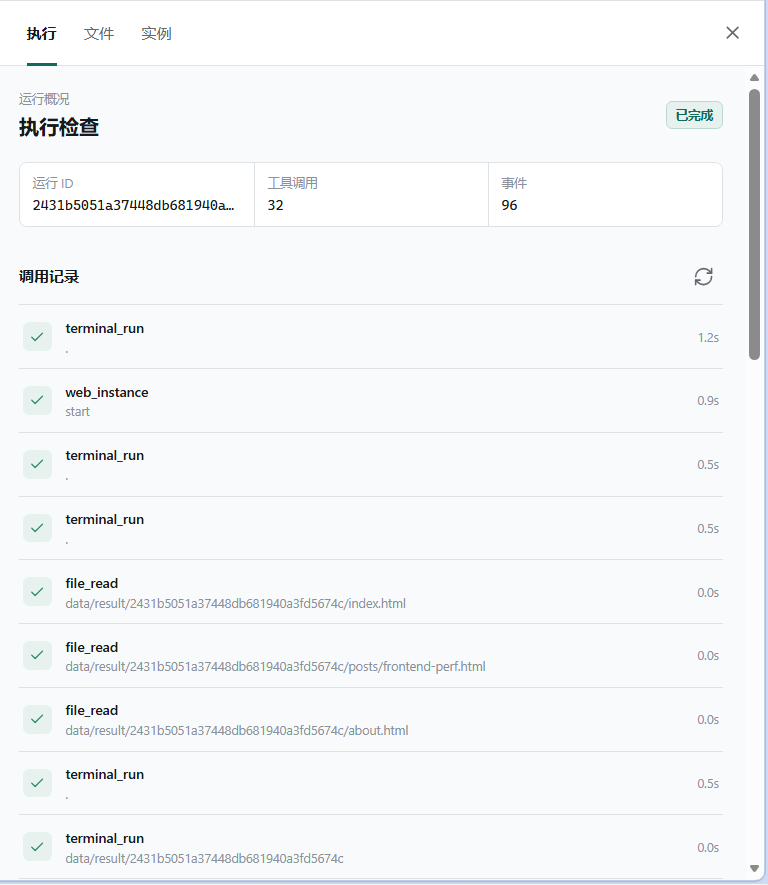
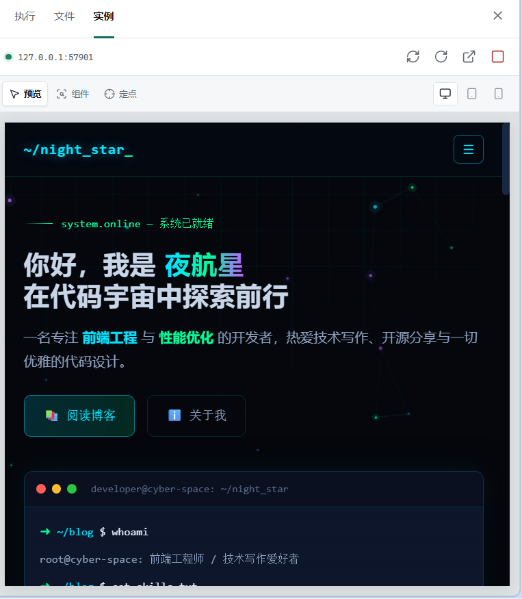
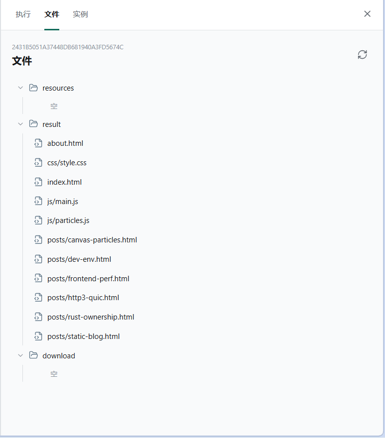

# WebWeave

> **WebWeave** - 让网页生成变得简单高效！

[](https://www.python.org/)
[](https://github.com/openai/openai-python)
[](LICENSE)

## 项目简介

WebWeave 是一个本地运行的智能网页生成工作台。用户只需要用自然语言描述目标，Agent 就会完成需求理解、资料检索、文件生成、命令执行和网页实例预览，并把每一步过程保存在独立的对话运行目录中。

WebWeave 采用 OpenAI 兼容的 Responses API。它适合快速生成网页原型、个人网站、博客、后台页面和交互式前端项目，也适合作为可扩展的本地 Agent 基础工程。

## 技术栈

| 层次 | 技术 | 用途 |
| --- | --- | --- |
| 运行时 | Python 3.10+ | Agent、WebUI 服务和工具执行 |
| 大模型 | OpenAI Python SDK、Responses API | 主模型推理、流式输出和工具调用 |
| 兼容服务 | OpenAI 兼容接口 | 可连接 DeepSeek 或其他兼容服务 |
| 后端 | Python 标准库 `http.server`、`ThreadingHTTPServer` | 本地 HTTP API、静态文件服务和预览代理 |
| 前端 | HTML、CSS、原生 JavaScript | 无构建步骤的工作台界面 |
| 图标 | Lucide | 导航、工具栏和状态图标 |
| Skill | YAML front matter、PyYAML | Skill 发现、校验和读取 |
| 持久化 | JSON、JSONL、本地文件目录 | 配置、运行状态、事件、上下文和生成结果 |

## 效果展示

### 完整工作台

工作台同时展示对话过程、工具调用和生成网页实例，用户可以在一次对话中完成生成、验证和修改。



### 主页与任务入口

主页提供新建对话和最近工作入口，历史对话可以从左侧导航继续打开或删除。



### 工具调用状态

执行检查区会记录每次工具调用、耗时、运行状态和事件数量，便于定位生成过程中的问题。



### 生成实例预览

生成结果可以直接在 WebUI 的实例面板中预览，并支持预览、组件选择、定点评价和设备尺寸切换。



### 运行文件树

每个对话拥有隔离的资源、结果和下载目录，文件可以在 WebUI 中查看、预览和复制。



## 项目结构

```text
WebWeave/
├── core/                         # Agent、配置、运行状态和 WebUI 后端
│   ├── agent.py                  # Responses API Agent 循环
│   ├── config.py                 # config.json 热加载和配置校验
│   ├── context.py                # 上下文压缩和保留策略
│   ├── instance.py               # Web 实例进程与健康检查
│   ├── paths.py                  # 运行目录和路径边界
│   ├── preview.py                # 实例预览代理和检查桥接
│   ├── prompt.py                 # Agent 系统提示词
│   ├── run_store.py              # 运行状态、事件和上下文存储
│   ├── vision.py                 # 图片转文字和视觉模型适配
│   ├── web.py                    # WebUI 服务和本地 API
│   ├── web_jobs.py               # 后台任务、停止和继续
│   └── __main__.py               # python -m core 入口
├── tools/                        # 可热加载的 Agent 工具
│   ├── file_generation.py        # 在结果目录生成文件
│   ├── file_read.py              # 读取运行范围内的文件
│   ├── registry.py               # 工具发现、校验和热加载
│   ├── skill_discovery.py        # Skill 列表和内容读取
│   ├── terminal.py               # 运行范围内的 PowerShell 命令
│   ├── web_instance.py           # Web 实例生命周期管理
│   └── web_search.py              # 搜索和下载网页资料
├── skills/                       # Skill 加载器代码
│   └── loader.py
├── webui/                        # 原生 HTML/CSS/JavaScript 工作台
│   ├── index.html
│   ├── app.js
│   └── styles.css
├── data/
│   ├── background/               # WebUI 背景图
│   ├── download/{运行ID}/        # 当前运行下载的资料
│   ├── resources/{运行ID}/       # 当前运行上传的附件
│   ├── result/{运行ID}/          # Agent 生成的项目文件
│   ├── run/{运行ID}/             # 事件、状态和上下文快照
│   └── skills/{名称}/SKILL.md    # 本地 Skill 内容
├── assert/                       # README 效果截图
├── config.json                   # 本地运行配置
├── config.json.example           # 配置模板
├── requirements.txt              # Python 依赖
├── LICENSE                       # Apache 2.0 许可证
└── README.md
```

## 主要功能

### 1. 自然语言网页生成

Agent 使用 ReAct 循环理解需求，并按需调用工具完成任务。每轮模型响应都可以继续读取工具结果，直到生成结果或向用户询问必要信息。

当前内置工具包括：

- `list_skills`、`read_skill`：发现并读取本地 Skill
- `web_search`：检索网页资料并下载文件
- `file_read`、`create_file`：读取输入和生成结果文件
- `terminal_run`：在当前运行目录执行 PowerShell 命令
- `web_instance`：启动、查看、停止和重启生成的网页实例

工具可以在 `config.json` 中独立启用、禁用和设置是否接收当前运行 ID。

### 2. 对话运行隔离

每个对话都有唯一运行 ID，输入资源、生成结果、下载文件、事件日志、状态和上下文互相隔离。对话支持：

- 流式显示模型输出
- 协作式停止和停止后继续
- 历史记录重新打开
- 对话记录和关联运行文件删除
- 运行事件和工具调用追踪

### 3. 可选视觉模型

图片附件可以直接交给主模型，也可以启用独立视觉模型先生成文字描述，再交给主模型处理：

- `llm.vision.enabled=false`：主模型直接识别图片
- `llm.vision.enabled=true`：视觉模型负责图片转文字，主模型负责任务推理
- 视觉模型调用失败时，会回退为主模型的多模态输入

### 4. 生成实例与检查

Agent 生成网页后，可以通过实例面板直接查看本地预览。检查区提供：

- 预览、组件选择和定点评价模式
- 桌面、平板和手机尺寸切换
- 同源 HTTP/WebSocket 预览代理
- 实例刷新、重启、停止和新窗口打开

### 5. 文件树与结果预览

文件面板会按 `resources`、`result` 和 `download` 展示运行目录，支持文本预览、图片预览和内容复制。生成项目默认写入 `data/result/{运行ID}`。

### 6. 设置、主题和 Skill 管理

WebUI 设置页分为配置、大模型和样式三个子页面：

- 运行时模型、工具、超时和上下文压缩配置
- 主模型和可选视觉模型配置
- 主题切换和背景图上传
- API Key 在界面中以 `********` 掩码显示
- 左侧 Skills 页面展示 `data/skills` 下可用 Skill

背景图会保存到 `data/background`，不需要额外的静态资源构建步骤。

### 7. 上下文压缩与热加载

上下文达到 `config.json` 中的阈值后，Agent 会生成摘要并保留最近项目，降低长对话的输入成本。配置文件和工具模块支持运行时重新加载，修改后下一次请求即可使用新配置。

## 安装指南

### 环境要求

- Python 3.10 或更高版本
- 一个 OpenAI 兼容的大模型服务和 API Key
- Windows、Linux 或 macOS

### 1. 获取项目

```bash
git clone https://github.com/Gong-Yie/WebWeave.git
cd WebWeave
```

### 2. 创建虚拟环境

Windows PowerShell：

```powershell
py -3.10 -m venv .venv
.\.venv\Scripts\Activate.ps1
```

Linux 或 macOS：

```bash
python3 -m venv .venv
source .venv/bin/activate
```

### 3. 安装依赖

```bash
python -m pip install --upgrade pip
python -m pip install -r requirements.txt
```

### 4. 配置大模型

首次安装且项目根目录没有 `config.json` 时，可以复制配置模板：

```powershell
Copy-Item config.json.example config.json
```

编辑 `config.json` 的 `llm` 节点：

```json
{
  "llm": {
    "main": {
      "model": "your-main-model",
      "base_url": "https://api.example.com/v1",
      "api_key": "your-main-api-key"
    },
    "vision": {
      "enabled": false,
      "model": "",
      "base_url": "",
      "api_key": ""
    }
  }
}
```

`llm.main` 是主模型配置。视觉模型是可选的，只有在 `enabled` 为 `true` 时才需要填写完整的模型、地址和 Key。LLM 配置统一保存在 `config.json`，不再从 `.env` 读取。请勿将真实 API Key 提交到 Git 仓库。

其他运行参数包括：

- `model.stream`：是否流式输出
- `tools.<name>.enabled`：是否向模型暴露工具
- `tools.<name>.run_scoped`：是否传入当前运行 ID
- `tool_timeout`：工具默认和最大超时
- `context`：上下文压缩开关、阈值和保留项目数

也可以直接在 WebUI 的“设置 → 大模型”和“设置 → 配置”页面修改，配置会被校验并原子写入。

模型连接遇到超时、连接中断、限流或服务端错误时会自动重试，最多 5 次；请求参数错误不会重试。

## 使用方法

### 1. 启动 WebUI

```bash
python -m core
```

默认地址为：

<http://127.0.0.1:8765>

自定义端口：

```bash
python -m core --host 127.0.0.1 --port 8765
```

服务默认只监听本机地址，适合本地使用。启动后在浏览器打开地址即可进入 WebWeave 工作台。

### 2. 完成一次网页任务

1. 点击“新建对话”或左侧“开始工作”。
2. 描述网页目标、页面结构、视觉风格和交互要求。
3. 通过附件按钮上传参考图、需求文档或其他资源。
4. 观察对话区和执行检查区中的工具调用过程。
5. 在“实例”面板预览生成结果，必要时使用组件选择或定点评价。
6. 在同一对话中继续提出修改要求，Agent 会使用已有上下文继续工作。
7. 在“文件”面板检查生成文件，最终项目位于 `data/result/{运行ID}`。

### 3. 使用 Skills

在 `data/skills` 下新增一个目录，并创建带 front matter 的 `SKILL.md`：

```text
data/skills/my_skill/SKILL.md
```

```markdown
---
name: my_skill
description: 描述这个 Skill 解决什么问题。
---

# 使用说明

在这里写给 Agent 的具体工作规则、检查步骤和输出要求。
```

刷新 WebUI 的 Skills 页面后，Agent 也可以通过 `list_skills` 和 `read_skill` 发现并读取它。

### 4. 管理主题和背景图

进入“设置 → 样式”选择主题或上传 PNG、JPG、WebP 背景图。背景图会保存到 `data/background`，删除背景不会影响对话和生成结果。

### 5. 本地 API

WebUI 同时提供用于前端和自动化集成的本地 API：

| 方法 | 路径 | 作用 |
| --- | --- | --- |
| `GET` | `/api/health` | 检查服务状态 |
| `GET` / `PUT` | `/api/config` | 读取或保存运行配置 |
| `GET` | `/api/skills` | 获取本地 Skill 列表 |
| `GET` / `POST` | `/api/runs` | 列出或创建对话 |
| `DELETE` | `/api/runs/{run_id}` | 删除对话及其运行目录 |

## 贡献指南

欢迎通过 Issue、Pull Request 或 Skill 提交改进建议。建议遵循以下流程：

1. 先创建 Issue，说明问题、复现步骤或功能目标。
2. 从最新代码创建独立分支，保持一次提交只解决一个主题。
3. 修改前阅读相关模块和配置，尽量复用现有工具链和目录边界。
4. 新增行为时补充直接相关的测试或可复现验证步骤。
5. 提交前运行最小必要检查：

   ```powershell
   python -B -m py_compile core\web.py core\config.py
   node --check webui\app.js
   ```

6. 不要提交真实 API Key、运行生成物、个人背景图或临时调试文件。
7. Pull Request 中请说明改动范围、验证命令和已知限制。

## 许可证

WebWeave 采用 [Apache License 2.0](LICENSE) 开源。使用、修改和再分发本项目时，请保留许可证和相关版权声明。


---

**WebWeave** - 让网页生成变得简单高效！
